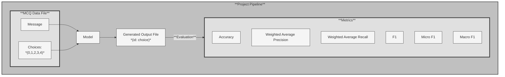

```mermaid
graph TD;
    subgraph Pipeline["<span style='font-size:50;'>**Project Pipeline**</span>"]
        subgraph Data[**MCQ Data File**]
            direction TB
            A[Message]
            B["Choices: <br> *(0,1,2,3,4)*"]
        end

        A--> C[Model]
        B--> C[Model]
        C-->D["Generated Output File <br> *(id: choice)*"]

        subgraph Evaluate["**Metrics**"]
            direction TB
            1[Accuracy]
            2[Weighted Average Precision]
            3[Weighted Average Recall]
            4[F1]
            5[Micro F1]
            6[Macro F1]
        end

        D-- **Evaluation** -->Evaluate
    
    end

    %% Node Color
    classDef lightGrayNode fill:#e0e0e0, stroke: #333,stroke-width:3px;
    classDef grayNode fill:#C0C0C0,stroke:#333,stroke-width:2px;
    classDef whiteNode fill:#F5F5F5,stroke:#333,stroke-width:1px;
    classDef comment fill:#DCDCDC,stroke:#333,stroke-width:1px,font-style:italic,font-size:12px;

    %% Node Color Assignment
    class Pipeline grayNode
    class Data,Evaluate lightGrayNode
    class A,B,C,D,1,2,3,4,5,6 whiteNode
    class Evaluation comment

    %% Font Size
    classDef title font-size:20px,fill:#ffffff,stroke:#333,stroke-width:2px;

    %% Font Assignment
    classDef Pipeline title
```